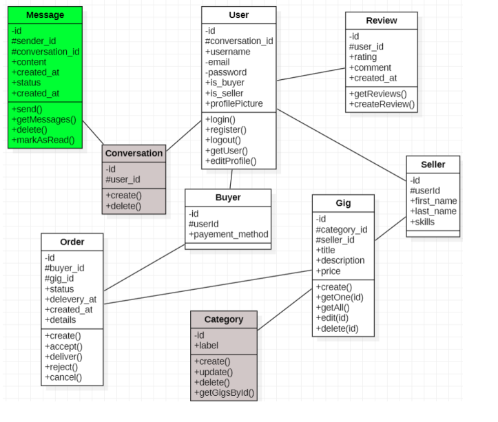
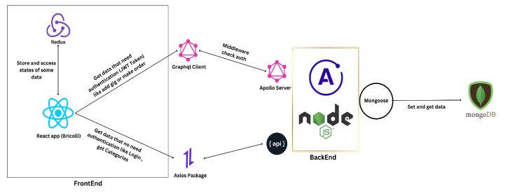
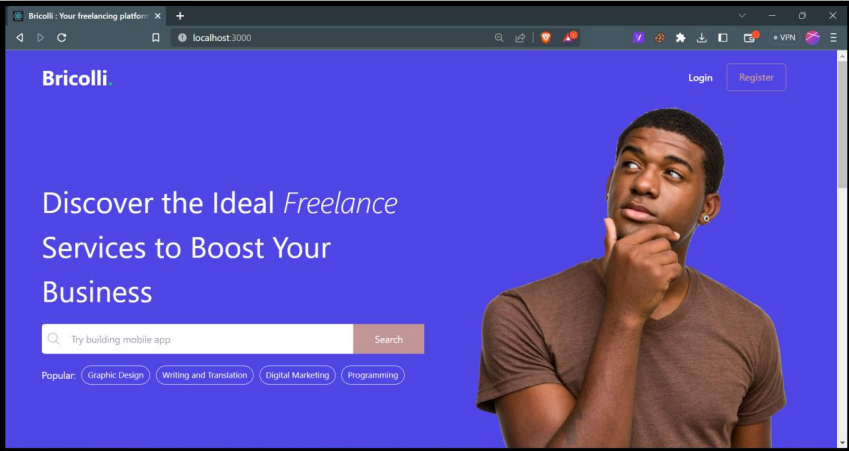
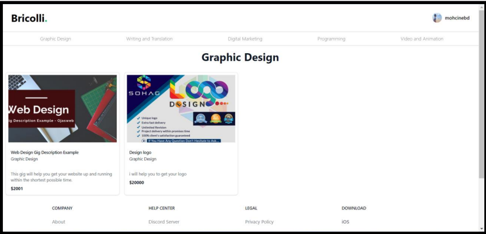
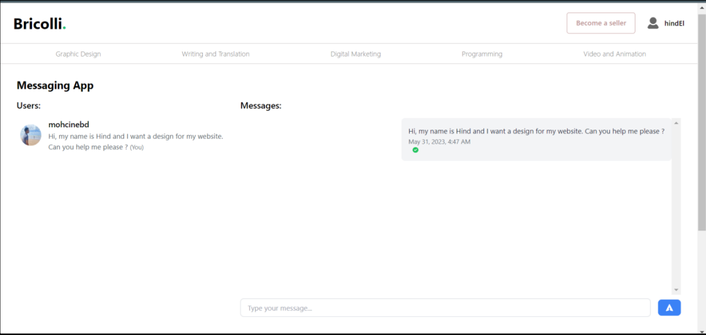
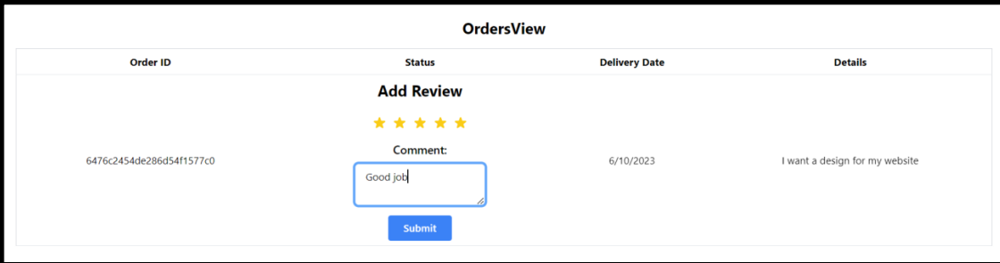

# .Bricolli

## Introduction
In this project, we will build a Fiverr clone using the MERN stack (MongoDB, Express.js, React.js, Node.js) and GraphQL. Fiverr is a popular online marketplace connecting freelancers and clients. By creating this clone, we will gain hands-on experience with backend and frontend development using the MERN stack, while leveraging GraphQL for efficient data retrieval and manipulation.

## What is a PWA?
Progressive web applications (PWAs) are web applications with practical improvements that allow them to work like desktop or mobile apps. PWAs offer features such as offline functionality, an app-like interface, push notifications, and the ability to be installed on the user's device.

## Features
- Sign up as a freelancer or a client
- Create and manage your profile
- Browse and search for services
- Place orders
- Message and communicate with freelancers
- Leave reviews and ratings
- Offline functionality for uninterrupted usage
- Install the application on your device for quick access

## Installation
To run this project locally, follow these steps:

1. Clone the repository:
   ```bash
   git clone https://github.com/S2-Projects/clone-fiverr
   ```
2. Change to the project's directory:
    ```bash
   cd clone-fiverr
   ```
3. Install the dependencies for both the frontend and backend:
     ```bash
    cd frontend && npm install
    cd ../backend && npm install
     ```
4. Configure the environment variables:
    - Create a .env file in the server directory.
    - Set the required environment variables, such as database connection URL and API keys. Refer to the .env.example file for the necessary variables.

5. Start the development server:
    ```bash
    cd ../frontend && npm start
    cd ../backend && npm run dev
     ```
6. Open your web browser and visit http://localhost:3000 to see the application running.

## Usage

- Visit the homepage and sign up as either a freelancer or a client.
- Create your profile, providing relevant information and skills.
- Browse available services, use the search functionality to find specific services, and filter the results.
- Click on a service to view its details, including the freelancer's profile and pricing.
- Place an order for a service
- Communicate with freelancers through the messaging system to discuss the project.
- Upon completion, leave a review and rating for the freelancer.
## Project Conception

In the conception phase, we identified the main entities and their relationships within the .Bricolli application. The class diagram below illustrates the core classes and their associations.

<p align="center">
  
</p>

## Project Architecture
<p align="center" style="padding:30px">
  
</p>


## Screenshots

<p align="center" style="padding:30px">
  
  
  <br>
  
  
</p>


## Contributing
We welcome contributions to enhance the features and functionality of this .Bricolli project. If you'd like to contribute, please follow these steps:

1. Fork the repository.
2. Create a new branch for your feature or bug fix.
3. Make the necessary changes and commit them.
4. Push your changes to your fork.
5. Submit a pull request detailing your changes.

## License
This project is licensed under the MIT License.

## Acknowledgements
We would like to acknowledge the following resources and libraries that helped us build this project:

- MERN Stack
- GraphQL
- React
- Node.js
- Express.js

## Contributed by
This project was collaboratively developed by [Boudenjal Mohcine](https://github.com/boudenjal-mohcine) and [El Ouahabi Hind](https://github.com/elouahabihind). We worked together to implement various features and ensure the smooth functioning of Bricolli application.

## Oriented by
This project was oriented by Lotfi ELAACHAK, a professor at FST Tangier.
